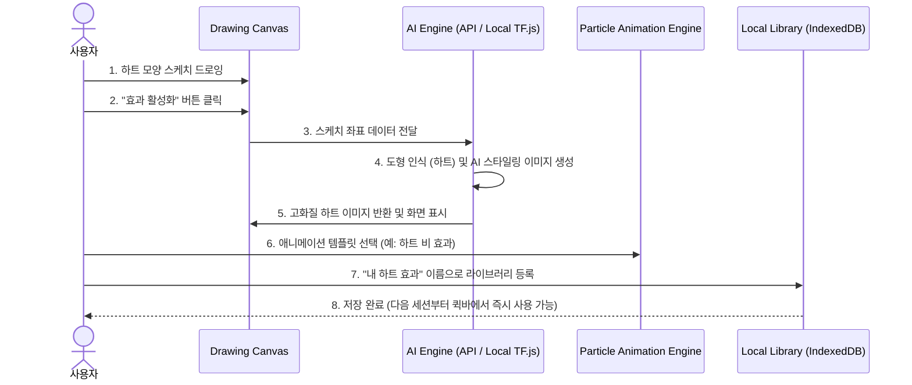
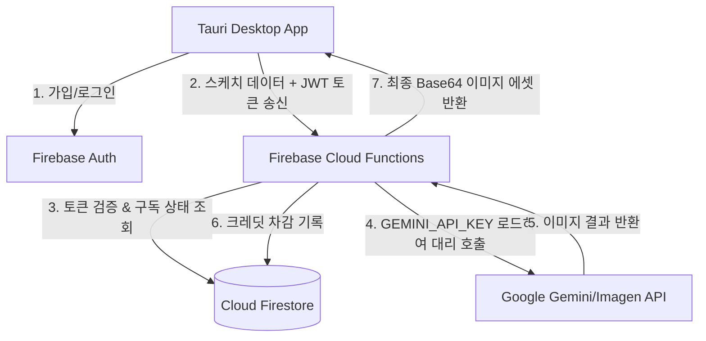

# 커스텀 AI 스케치 효과 엔진 (Custom AI Sketch Effect Engine) 기획 및 개발 계획서

본 문서는 사용자의 자유로운 스케치(판서)를 AI로 인식하고, 이를 프리미엄 디자인 이미지 및 애니메이션 효과로 변환하여 발표의 집중도를 극대화하는 **"커스텀 AI 스케치 효과 엔진"**의 기획 및 개발 계획서입니다.

---

## 1. 아이디어 피드백 및 시장성 평가

### 💡 핵심 혁신 포인트
* **직관적인 인터랙션**: 마우스나 펜으로 간단히 낙서하듯 그리면(예: 하트, 별, 구름) 발표자가 구구절절 설명하거나 찾을 필요 없이 화면에 즉각적으로 화려한 연출이 생성됩니다.
* **학습/프레젠테이션 최적화**: 교육용(교사-학생), 기업용 프레젠테이션에서 청중의 흥미와 리액션을 유도하기에 완벽한 도구입니다.
* **유료화(Monetization) 확장성**: 기본 템플릿(별, 하트 등 3개)은 무료로 제공하되, 무제한 AI 변환 커스텀 라이브러리 등록, 고급 파티클 애니메이션 템플릿 등은 **Pro 등급(구독형 또는 1회성 인앱 구매)**으로 묶어 비즈니스 모델로 직결할 수 있습니다.

---

## 2. 유사 앱 및 기술 조사 분석

| 서비스/기술명 | 주요 기능 | 장점 | SlidePen Pro 적용 방식 |
| :--- | :--- | :--- | :--- |
| **Google AutoDraw** | 러프한 스케치를 실시간 인식하여 정제된 벡터 아이콘으로 교체 | 실시간 가볍고 정확한 스케치 분류 | 로컬 스케치 인식 신경망(TensorFlow.js)을 활용하여 하트, 별, 체크마크 등을 실시간으로 분류 |
| **Scribble Diffusion** | 스케치 + 프롬프트를 통해 고화질 AI 이미지 생성 | 높은 디테일과 예술적 스타일 적용 | 백엔드 API(Stable Diffusion / Dall-E 등)와 연동하여 사용자가 그린 모양을 기반으로 입체 3D 하트, 크리스탈 하트 등으로 고급 렌더링 |
| **Meta Animated Drawings** | 캐릭터 스케치를 스켈레톤 추출하여 관절 애니메이션으로 구현 | 드로잉에 생동감 있는 모션 부여 | 파티클 엔진(Canvas Particle)과 결합하여, 생성된 이미지가 화면 전체에 눈처럼 내리거나 폭죽처럼 터지는 물리 엔진 적용 |

---

## 3. 기능 요구사항 정의 (Core Features)

### 🎨 1) 스케치 캡처 및 AI 분류기 (AI Classifier)
* **스케치 그리기**: 사용자가 "AI 스케치 모드"를 활성화하고 캔버스에 선을 그립니다.
* **객체 인식 (Object Detection)**: 
  * 로컬 브라우저에서 실행 가능한 가벼운 **TensorFlow.js** 모델 또는 백엔드 **API**를 사용하여 그린 도형의 종류(하트, 별, 꽃, 고양이 등)를 확률로 분류합니다.
* **사용자 컨펌 단계**: "인식된 모양: **[하트 ❤️]** 가 맞습니까?" 팝업 제공 (수동 선택 보정 기능 제공).

### 🪄 2) AI 스타일러 (Generative AI Stylization)
* **이미지 생성**: 인식된 하트를 기반으로, 사전에 설정된 테마(예: "네온 사이버펑크", "러블리 핑크 3D 글래스", "판타지 골드 크리스탈")에 따라 AI 고화질 일러스트/PNG 에셋을 생성합니다.
* **스마트 캐싱**: 매번 생성 비용이 들지 않도록, 한 번 생성한 하트 이미지는 로컬에 캐싱 및 저장합니다.

### 🎡 3) 파티클 애니메이션 템플릿 (Animation Presets)
사용자가 다음의 다양한 물리/애니메이션 연출 템플릿을 선택하여 생성된 이미지에 적용할 수 있습니다.
* **폭죽형 (Explosion)**: 그려진 위치에서 원형으로 사방으로 튕겨 나갔다 사라지는 효과.
* **비/눈송이형 (Rain/Snow)**: 화면 상단에서 아래로 부드럽게 떨어져 내리는 효과.
* **상승 풍선형 (Floating)**: 비눗방울처럼 화면 아래에서 위로 둥둥 떠서 올라가는 효과.
* **경로 추적형 (Orbit)**: 발표자 마우스 포인터 주변을 회전하며 따라다니는 효과.

### 💾 4) 커스텀 효과 라이브러리 (Library Manager)
* **저장 및 등록**: 생성된 이미지 + 적용한 애니메이션 효과 템플릿 + 스케치 트리거 패턴을 하나의 "커스텀 이펙트"로 패키징하여 로컬 저장소(IndexedDB / LocalStorage)에 저장합니다.
* **빠른 실행 퀵바**: 플로팅 툴바에 커스텀 라이브러리 아이콘을 추가하여 발표 중에 바로 꺼내어 쓸 수 있도록 구성합니다.

---

## 4. 시스템 아키텍처 및 데이터 흐름

---

## 5. 크레딧 비용 산정 및 유료화 요금제 (Credit Cost & Pricing Model)

AI 스케치-투-이미지 변환 기능은 서버 GPU 리소스(Imagen 4.0 및 Gemini 2.5 API)를 사용하므로 작동 시 실시간 API 호출 비용이 발생합니다. 이에 따른 적정 원가 분석 및 사용자 크레딧 시스템 설계는 다음과 같습니다.

### 💰 1) AI API 호출 원가 분석 (원가 기준)
* **사용 기술**: Gemini 2.5 Flash (스케치 비전 판독) + Imagen 4.0 (이미지 생성)
* **API 제공사 기준 원가** (Google Cloud AI Studio 기준):
  * Gemini 2.5 Flash 비전 분석 (1회 호출): 약 **$0.00015** (한화 약 **0.2원** / 입력 토큰 1,000 기준)
  * Imagen 4.0 이미지 생성 (1회 호출): 약 **$0.03** (한화 약 **40원** / 이미지 1장 기준)
  * 총 합산 1회 AI 효과 변환 원가: **약 41원**

### 💳 2) 크레딧 요금제 및 수익성 설계 (1회 생성 = 1 크레딧 차감)
사용자(특히 학생/교사)들이 부담 없이 소액 인앱 결제 형태로 충전할 수 있도록 가격 문턱을 낮추고 마진을 방어하는 최적 요금제를 제안합니다. (1달러 = 1,300원 환율 기준)

| 요금제 유형 | 가격 | 제공 크레딧 | 크레딧 당 단가 | 추정 원가 (장당 41원) | 마진율 |
| :--- | :--- | :--- | :--- | :--- | :--- |
| **Free (체험판)** | 무료 (가입 시 최초 1회) | 10 Credits (7일 기한) | - | 약 410원 | - |
| **Starter Pack** | $0.99 (약 1,300원) | 10 Credits | 130원 | 410원 | **68.4%** |
| **Normal Pack** | $1.99 (약 2,600원) | 30 Credits | 86.6원 | 1,230원 | **52.6%** |
| **Student Pro (구독)** | $4.99/월 (약 6,500원) | 100 Credits/월 + 무제한 저장 | 65원 | 4,100원 | **36.9%** |

*※ 주의 및 효과: 100 크레딧 단일 팩 $3.99는 학생 사용자에게 결제 장벽이 존재하지만, $0.99(약 1,300원) 및 $1.99(약 2,600원) 소액 팩은 모바일/데스크톱 소액 충전 심리를 자극하여 구매 빈도를 대폭 늘릴 수 있습니다. 마진율 또한 35~50% 선을 유지하여 비용 리스크를 완벽하게 방어합니다.*

### 🛠️ 3) 비용 최적화 설계 (원가 절감 방안)
* **로컬 캐싱 라이브러리 (0 크레딧)**:
  * 사용자가 한 번 생성하여 등록한 커스텀 효과(예: "글래스 핑크 하트")는 클라우드 서버에 다시 요청하지 않고, 로컬 스토리지(`IndexedDB`)에 저장된 이미지를 사용하므로 **이후 사용 시 크레딧 비용이 전혀 발생하지 않습니다 (0원)**.
* **로컬 사전 필터링 (Local Pre-Filtering)**:
  * 사용자가 스케치를 그리는 즉시 브라우저 로컬 단의 가벼운 필터링을 수행합니다. 사용자가 "확인" 버튼을 눌러 확정했을 때만 AI API 서버로 요청을 전송하여 무의미한 낙서로 인한 API 낭비를 방지합니다.

---

## 6. Firebase 기반 API 보안 및 크레딧 관리 아키텍처

데스크톱 앱(`exe`, `dmg`)은 패키지 해제 및 패킷 캡처에 취약하므로, **Google Gemini API Key를 절대 클라이언트 앱 내부에 포함하지 않고 Firebase 백엔드를 중개소로 활용**하여 보안을 제어합니다.

### 🔐 1) API Key 보안 수립 (Firebase Functions 프록시)
* **API Key 격리**: `GEMINI_API_KEY`는 오직 **Firebase Cloud Functions (서버리스 백엔드)** 환경 변수에만 안전하게 보관합니다.
* **앱 통신 우회**: 데스크톱 앱은 구글 API를 직접 호출하지 않고, Firebase Cloud Functions 엔드포인트(예: `/api/convertSketch`)로 호출을 요청합니다.

### 👤 2) 회원 관리 및 인증 (Firebase Auth & Google Sign-In)
* **소셜 로그인 탑재 (구글 로그인)**: 사용자의 이메일 기반 가입 및 간편 로그인을 위해 **Firebase Auth Google OAuth 2.0** 인증 방식을 기본 탑재합니다.
  * Tauri 데스크톱 앱 내에서 안전하게 구글 OAuth 팝업창 또는 루프백 루틴을 띄워 구글 계정 정보를 가져오고 인증 세션을 획득합니다.
* **유저 세션 관리**: 로그인에 성공하면 Firebase SDK를 통해 발급된 **JWT 인증 토큰**을 프론트엔드에 저장하고 만료 시 자동 갱신합니다.
* **보안 통신**: 모든 API 요청 시 HTTP Authorization 헤더에 이 토큰을 실어 전송하며, Cloud Functions 서버는 이를 디코딩하여 유효한 회원 상태인지 검증합니다.

### 📊 3) 크레딧 및 구독 데이터 연동 (Cloud Firestore)
* **사용자 도큐먼트**: Firestore 내에 `users/{userId}` 경로로 각 유저의 `credits` 잔여량 및 정기구독 여부(`isSubscribed`)를 기록합니다.
* **크레딧 실시간 확인**: Cloud Functions는 Gemini/Imagen API를 대신 호출하기 전, Firestore를 조회하여 해당 유저의 잔여 크레딧이 1개 이상인지 검사하고, 호출 완료 후 성공 시 크레딧을 1개 차감(`credits = credits - 1`)합니다.

---

## 7. 기업 보안(차단) 및 환불 리스크 관리 방안 (Risk Mitigation)

회사 PC나 공공기관 PC에 깔린 화면 캡처 방지 솔루션(DRM, DLP 등)으로 인해 화면 공유 및 오버레이 판서가 차단되는 현상에 대비하고, 환불 분쟁을 최소화하기 위한 비즈니스/기술적 보완 대책입니다.

### 🎁 1) 7일 무료 체험(Free Trial) 제도 도입
* **사전 검증 유도**: 모든 유료 요금제 결제 전, 혹은 가입 시 **7일간 무료 체험(10 크레딧)** 혜택을 필수 제공합니다.
* **효과**: 사용자가 본인의 근무 환경(회사 PC)에서 투명 오버레이 및 화면 공유 기능이 보안 프로그램에 의해 차단되는지 결제 전에 직접 자가 테스트하도록 유도하여 환불 사태를 원천 차단합니다.

### ⚠️ 2) 이용약관 및 결제 페이지 면책 조항(Disclaimer) 명시
* **명문화**: 마켓 스토어 설명란, 결제 팝업창, 그리고 이용 약관에 기업 보안 소프트웨어 작동 시의 제한 사항을 명문화합니다.
* **면책 예시**: *"본 프로그램의 화면 공유 및 투명 칠판 오버레이 기능은 사내 보안 소프트웨어(DRM, DLP, 화면 캡처 차단 프로그램)가 탑재된 PC에서 정상 작동하지 않을 수 있습니다. 결제 전 반드시 무료 체험을 진행해 주시기 바랍니다."*

### 🗂️ 3) 보안 PC용 대체 모드 (자체 프레젠터 모드) 강화
* **보안 우회 작동**: 전체 화면을 실시간 캡처하는 투명 오버레이가 막힌 보안 PC 환경에서도 앱을 유용하게 쓸 수 있도록, **자체 프레젠터 모드(B플랜)**를 강력하게 지원합니다.
* **우회 방법**: 윈도우 투명화를 쓰지 않는 일반 프로그램 창 형태의 **[📁 PDF 파일 발표 모드]** 및 **[🖼️ 이미지 슬라이드 모드]**를 사용하여 발표 자료를 앱 내에 직접 띄우고 판서하도록 유도합니다. 이 방식은 보안 프로그램의 화면 차단 기술에 일절 걸리지 않고 정상 작동합니다.

### 🚨 4) 실행 오류 자가 진단 및 경고 팝업 기능
* **자가 검사**: 화면 공유 시작 시 캡처 스트림을 검사하여 검은 화면(0px 또는 무반응)이 지속되거나 예외 에러가 검출되면, 시스템 장애가 아니라 보안 프로그램 차단으로 인한 현상임을 유저에게 팝업창 가이드로 상세히 설명하여 신뢰도를 유지합니다.

---

## 8. 단계별 개발 로드맵

### 1단계: MVP 개발 및 UI 개선 (완료)
* 스케치 변환 이미지의 가독성을 높이기 위해 Gemini 2.5 Flash 및 Imagen 4.0 API로 이식 완료.
* 파티클 애니메이션(🎆 폭죽, 🌧️ 비, 🫧 둥실)이 화면 전체 높이로 정상 표현되도록 보정 완료.
* 사용성을 향상하기 위해 **스티커(스탬프) 크기 조절 슬라이더** 및 **AI 이펙트 크기 조절 슬라이더** 기능 구현 완료.
* 화면 공유 대기실에 직관적인 **[이전으로 돌아가기(취소)]** 버튼 구현 완료.

### 2단계: Firebase 백엔드 연동 및 API Key 격리 (예정)
* Firebase CLI 설치 및 Cloud Functions 프로젝트 초기화.
* Gemini API Key를 로컬 `.env`에서 삭제하고 Firebase Secret Manager(혹은 Config)에 보관.
* React 클라이언트에서 Firebase SDK 연동 및 구글 소셜 로그인(Google Sign-In) / 이메일 로그인 UI 구축.
* API 직접 호출부를 Firebase Functions HTTPS 호출로 전환.

### 3단계: 결제 모듈(Stripe) 탑재 및 스토어 릴리즈 준비 (예정)
* Stripe 결제 연동을 통해 구독 결제 및 크레딧 충전 기능 활성화.
* Microsoft Store 개발자 계정 등록(개인 $19 일회성 수수료 결제) 및 앱 패키지 심사 제출.
* Mac App Store 배포를 위한 애플 개발자 연간 프로그램 가입 및 앱 공증(Notarization) 진행.
