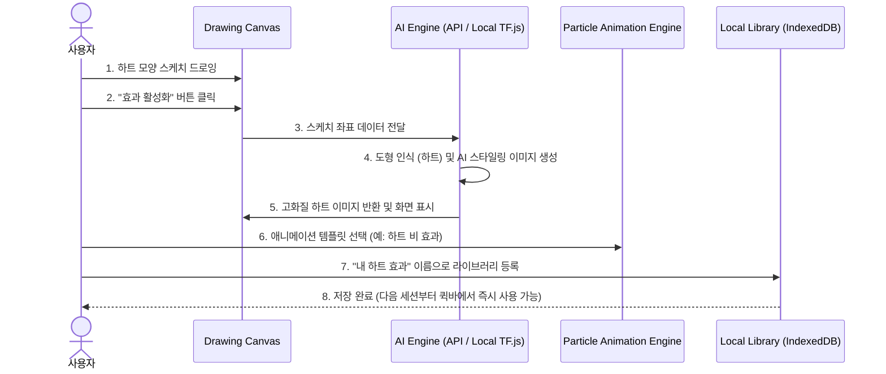

# 커스텀 AI 스케치 효과 엔진 (Custom AI Sketch Effect Engine) 기획서

본 문서는 사용자의 자유로운 스케치(판서)를 AI로 인식하고, 이를 프리미엄 디자인 이미지 및 애니메이션 효과로 변환하여 발표의 집중도를 극대화하는 **"커스텀 AI 스케치 효과 엔진"**의 기획 및 개발 계획서입니다.

---

## 1. 아이디어 피드백 및 시장성 평가

### 💡 핵심 혁신 포인트
* **직관적인 인터랙션**: 마우스나 펜으로 간단히 낙서하듯 그리면(예: 하트, 별, 구름) 발표자가 구구절절 설명하거나 찾을 필요 없이 화면에 즉각적으로 화려한 연출이 생성됩니다.
* **학습/프레젠테이션 최적화**: 교육용(교사-학생), 기업용 프레젠테이션에서 청중의 흥미와 리액션을 유도하기에 완벽한 도구입니다.
* **유료화(Monetization) 확장성**: 기본 템플릿(별, 하트 등 3개)은 무료로 제공하되, 무제한 AI 변환 커스텀 라이브러리 등록, 고급 파티클 애니메이션 템플릿 등은 **Pro 등급(구독형 또는 1회성 인앱 구매)**으로 묶어 비즈니스 모델로 직결할 수 있습니다.

---

## 2. 유사 앱 및 기술 조사 분석

| 서비스/기술명 | 주요 기능 | 장점 | SlidePen Pro 적용 방식 |
| :--- | :--- | :--- | :--- |
| **Google AutoDraw** | 러프한 스케치를 실시간 인식하여 정제된 벡터 아이콘으로 교체 | 실시간 가볍고 정확한 스케치 분류 | 로컬 스케치 인식 신경망(TensorFlow.js)을 활용하여 하트, 별, 체크마크 등을 실시간으로 분류 |
| **Scribble Diffusion** | 스케치 + 프롬프트를 통해 고화질 AI 이미지 생성 | 높은 디테일과 예술적 스타일 적용 | 백엔드 API(Stable Diffusion / Dall-E 등)와 연동하여 사용자가 그린 모양을 기반으로 입체 3D 하트, 크리스탈 하트 등으로 고급 렌더링 |
| **Meta Animated Drawings** | 캐릭터 스케치를 스켈레톤 추출하여 관절 애니메이션으로 구현 | 드로잉에 생동감 있는 모션 부여 | 파티클 엔진(Canvas Particle)과 결합하여, 생성된 이미지가 화면 전체에 눈처럼 내리거나 폭죽처럼 터지는 물리 엔진 적용 |

---

## 3. 기능 요구사항 정의 (Core Features)

### 🎨 1) 스케치 캡처 및 AI 분류기 (AI Classifier)
* **스케치 그리기**: 사용자가 "AI 스케치 모드"를 활성화하고 캔버스에 선을 그립니다.
* **객체 인식 (Object Detection)**: 
  * 로컬 브라우저에서 실행 가능한 가벼운 **TensorFlow.js** 모델 또는 백엔드 **API**를 사용하여 그린 도형의 종류(하트, 별, 꽃, 고양이 등)를 확률로 분류합니다.
* **사용자 컨펌 단계**: "인식된 모양: **[하트 ❤️]** 가 맞습니까?" 팝업 제공 (수동 선택 보정 기능 제공).

### 🪄 2) AI 스타일러 (Generative AI Stylization)
* **이미지 생성**: 인식된 하트를 기반으로, 사전에 설정된 테마(예: "네온 사이버펑크", "러블리 핑크 3D 글래스", "판타지 골드 크리스탈")에 따라 AI 고화질 일러스트/PNG 에셋을 생성합니다.
* **스마트 캐싱**: 매번 생성 비용이 들지 않도록, 한 번 생성한 하트 이미지는 로컬에 캐싱 및 저장합니다.

### 🎡 3) 파티클 애니메이션 템플릿 (Animation Presets)
사용자가 다음의 다양한 물리/애니메이션 연출 템플릿을 선택하여 생성된 이미지에 적용할 수 있습니다.
* **폭죽형 (Explosion)**: 그려진 위치에서 원형으로 사방으로 튕겨 나갔다 사라지는 효과.
* **비/눈송이형 (Rain/Snow)**: 화면 상단에서 아래로 부드럽게 떨어져 내리는 효과.
* **상승 풍선형 (Floating)**: 비눗방울처럼 화면 아래에서 위로 둥둥 떠서 올라가는 효과.
* **경로 추적형 (Orbit)**: 발표자 마우스 포인터 주변을 회전하며 따라다니는 효과.

### 💾 4) 커스텀 효과 라이브러리 (Library Manager)
* **저장 및 등록**: 생성된 이미지 + 적용한 애니메이션 효과 템플릿 + 스케치 트리거 패턴을 하나의 "커스텀 이펙트"로 패키징하여 로컬 저장소(IndexedDB / LocalStorage)에 저장합니다.
* **빠른 실행 퀵바**: 플로팅 툴바에 커스텀 라이브러리 아이콘을 추가하여 발표 중에 바로 꺼내어 쓸 수 있도록 구성합니다.

---

## 4. 시스템 아키텍처 및 데이터 흐름

---

## 5. 크레딧 비용 산정 및 유료화 요금제 (Credit Cost & Pricing Model)

AI 스케치-투-이미지 변환 기능은 서버 GPU 리소스(ControlNet + Stable Diffusion API)를 사용하므로 작동 시 실시간 API 호출 비용이 발생합니다. 이에 따른 적정 원가 분석 및 사용자 크레딧 시스템 설계는 다음과 같습니다.

### 💰 1) AI API 호출 원가 분석 (원가 기준)
* **사용 기술**: ControlNet Scribble (스케치 매핑) + Stable Diffusion 1.5/XL/3.5 (이미지 생성)
* **API 제공사 기준 원가** (Replicate, ModelsLab, Segmind 등 평균):
  * 1회 이미지 생성(512x512 해상도 기준) 당 평균 원가: **$0.002 ~ $0.005** (한화 약 **3원 ~ 7원**)
  * 프리미엄 XL급 고해상도 생성 시 원가: **$0.01** (한화 약 **13원**)

### 💳 2) 크레딧 요금제 및 수익성 설계 (1회 생성 = 1 크레딧 차감)
사용자에게 판매할 크레딧 가격 단가를 책정하여 서버 비용 리스크를 방어하고 높은 마진율을 확보합니다.

| 요금제 유형 | 가격 | 제공 크레딧 | 크레딧 당 단가 | 추정 원가 (장당 7원) | 마진율 |
| :--- | :--- | :--- | :--- | :--- | :--- |
| **Free (체험판)** | 무료 | 10 Credits (최초 1회) | - | 약 70원 | - |
| **Light Pack** | $2.99 (약 4,000원) | 100 Credits | 40원 | 700원 | **82.5%** |
| **Power Pack** | $9.99 (약 13,800원) | 500 Credits | 27.6원 | 3,500원 | **74.6%** |
| **Pro 구독 (월간)** | $4.99/월 (약 6,800원) | 200 Credits/월 + 프리미엄 템플릿 언락 | 34원 (크레딧만 계산) | 1,400원 | **79.4%** |

### 🛠️ 3) 비용 최적화 설계 (원가 절감 방안)
서버 호출 횟수를 무분별하게 늘리지 않고 비용 효율성을 극대화하기 위한 앱 구조적 장치들입니다.

* **로컬 캐싱 라이브러리 (0 크레딧)**:
  * 사용자가 한 번 생성하여 등록한 커스텀 효과(예: "글래스 핑크 하트")는 클라우드 서버에 다시 요청하지 않고, 로컬 스토리지(`IndexedDB`)에 저장된 이미지를 사용하므로 **이후 사용 시 크레딧 비용이 전혀 발생하지 않습니다 (0원)**.
* **로컬 경량 분류 우선 작동 (Local Pre-Filtering)**:
  * 사용자가 스케치를 그리는 즉시 브라우저 로컬 단의 가벼운 모델(TensorFlow.js 등)을 통해 1차 형태 판독을 수행합니다. 사용자가 "확인" 버튼을 눌러 확정했을 때만 AI API 서버로 요청을 전송하여 무의미한 낙서로 인한 API 낭비를 방지합니다.
  * *예: 스케치가 너무 짧거나(점 하나 등), 형체를 알아볼 수 없는 경우 API 호출 차단.*
* **해상도 및 파라미터 최적화**:
  * 발표용 효과 이미지는 512x512 크기만으로도 화면 상에서 매우 깨끗하게 표시됩니다. 따라서 해상도를 512px로 고정하고 디노이징 스텝 수를 최적화하여 1회 호출 가격을 최저 수준($0.002)으로 억제합니다.

---

## 6. 단계별 개발 로드맵

### 1단계: MVP 개발 (핵심 파이프라인 구축)
* AI API 연동 전, 미리 만들어진 에셋(하트/별 PNG)과 간단한 스케치 매칭 테스트.
* 캔버스 파티클 엔진(Canvas Particle Engine)을 도입하여 '폭죽' 및 '비' 2가지 애니메이션 완성.

### 2단계: AI 연동 및 커스텀 라이브러리
* HuggingFace, OpenAI, 또는 Replicate API를 연동하여 스케치 기반 실시간 이미지 변환 구현.
* IndexedDB를 활용해 유저가 커스텀한 이미지를 저장하고 가져오는 라이브러리 탭 개발.

### 3단계: 유료화 결제 연동 및 폴리싱
* Tauri 내장 결제 혹은 웹 스트라이프(Stripe)를 통한 라이브러리 슬롯 확장 및 프리미엄 효과 템플릿 언락 결제 모듈 탑재.
